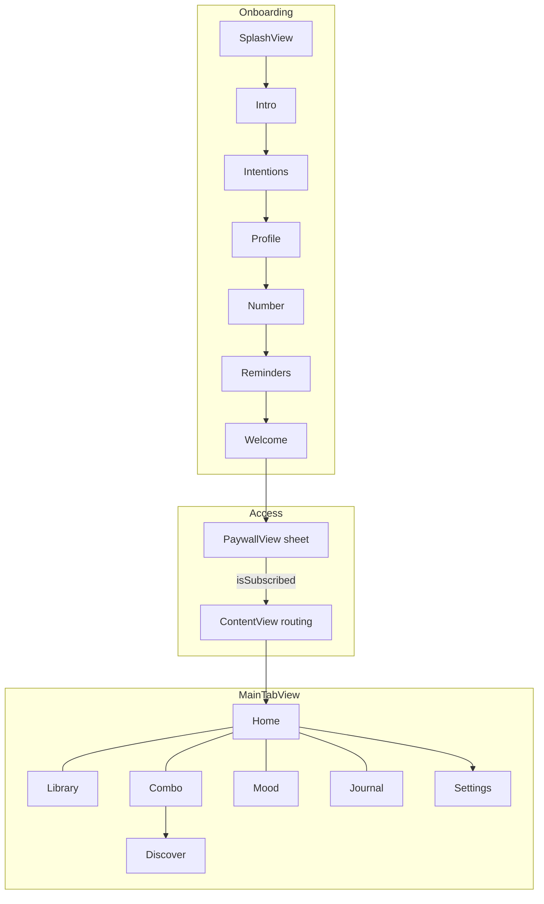
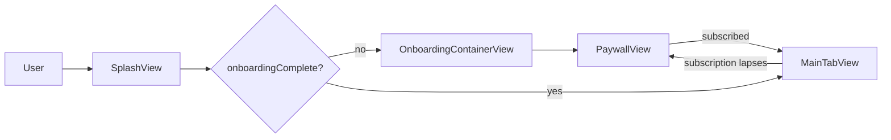

# Lumyn — Feature Map (native SwiftUI)

Living index of product nodes for the **native iOS app** (`Lumyn/`). Update when adding screens, managers, or Supabase integration.

## User journey (high level)

## Feature nodes

| Node | Entry | Status | Key files | Supabase |
|------|-------|--------|-----------|----------|
| **splash** | App launch | ✅ | `SplashView.swift` | — |
| **onboarding-intro** | Step 1–2 | ✅ | `OnboardingStepViews.swift`, `OnboardingContainerView.swift` | — |
| **onboarding-intentions** | Step 3 | ✅ | `OnboardingStepViews.swift` | `profiles.selected_intentions` 🔜 |
| **onboarding-profile** | Step 4 | ✅ | `OnboardingStepViews.swift` | `profiles` 🔜 |
| **onboarding-number** | Step 5 | ✅ | `OnboardingStepViews.swift`, `NumerologyService.swift` | numerology fields 🔜 |
| **onboarding-reminders** | Step 6 | ✅ | `OnboardingStepViews.swift`, `NotificationManager.swift` | reminder columns 🔜 |
| **onboarding-welcome** | Step 7 | ✅ | `OnboardingStepViews.swift` | — |
| **paywall** | Sheet after welcome | ✅ | `PaywallView.swift`, `SubscriptionManager.swift` | trial/plan 🔜 |
| **home** | Home tab | ✅ | `HomeView.swift`, `DailyWordService.swift`, `MoonService.swift` | streak 🔜 |
| **library** | Library tab | ✅ | `LibraryView.swift`, `WordDetailView.swift` | `saved_words` 🔜 |
| **session** | Word detail → session | ✅ | `SessionView.swift` | journal on complete 🔜 |
| **mantra** | Word detail → mantra | ✅ | `MantraView.swift` | — |
| **combo-builder** | Combo tab | ✅ | `ComboBuilderView.swift` | `saved_combos` 🔜 |
| **saved-combos** | Combo → Saved | ✅ | `SavedCombosView.swift` | 🔜 |
| **discover** | Saved → Discover | ✅ | `DiscoverView.swift` (bundled seed) | live feed 🔜 |
| **mood-checkin** | Mood tab | ✅ | `MoodCheckinView.swift`, `MoodResultView.swift` | `mood_checkins` 🔜 |
| **journal** | Journal tab | ✅ | `JournalView.swift` | journal + synchronicity 🔜 |
| **settings** | Home → gear | ✅ | `SettingsView.swift` | profile/settings 🔜 |
| **share-card** | — | 🔜 v1.1 | — | — |
| **sigil** | — | 🔜 v1.1 | — | — |
| **analytics** | Settings → Analytics | ✅ | `AnalyticsView.swift`, `AnalyticsService.swift` | — (local) |
| **widget** | Settings → Daily Word Widget | ✅ | `LumynWidget/`, `WidgetDataStore.swift` | — |
| **edit-profile** | — | 🔜 v1.1 | — | profile |
| **settings-intentions** | Settings → Your Intentions | ✅ | `IntentionsEditorView.swift`, `IntentionsGrid.swift` | `selected_intentions` 🔜 |
| **settings-feedback** | Settings → Send Feedback | ✅ | `FeedbackView.swift`, `FeedbackService.swift` | `feedback` |
| **cloud-backup** | — | 🔜 v1.1 | — | full sync |

## System nodes

| Node | Purpose | Status | Key files |
|------|---------|--------|-----------|
| **state-local** | Offline-first persistence | ✅ | `PersistenceManager.swift`, `AppState.swift` |
| **state-cloud** | Optional Supabase sync | 🔜 v1.1 | `supabase/migrations/` |
| **routing** | Splash → onboarding → tabs + paywall sheet | ✅ | `ContentView.swift`, `LumynApp.swift` |
| **notifications** | Daily/weekly local reminders | ✅ | `NotificationManager.swift` |
| **iap** | StoreKit 2 subscriptions | ✅ | `SubscriptionManager.swift`, `Products.storekit` |
| **catalog** | Bundled JSON content | ✅ | `DataCatalog.swift`, `Lumyn/Data/` |
| **switch-words-db** | 541 words + generator | ✅ | `data/switch-words-source.csv`, `generate-switch-words.py` |
| **design** | Golden Dawn palette + fonts | ✅ | `Color+Lumyn.swift`, `LumynTypography.swift`, `Fonts/` |
| **keepalive** | Prevent Supabase free-tier pause | ✅ | `.github/workflows/supabase-keepalive.yml` |

## Supabase migrations (run in order)

1. `00001_lumyn_schema.sql` — core tables, RLS, community seeds
2. `00002_profile_moods.sql` — profile fields, `mood_checkins`
3. `00003_subscription.sql` — paywall / trial fields on `profiles`
4. `00004_community_publish.sql` — `submitted_by`, insert policy on `community_combos`
5. `00005_feedback_reminders.sql` — `feedback` table, reminder frequency columns

## Access gates

## v1.0 native (shipped)

- SwiftUI app with XcodeGen (`project.yml`)
- StoreKit 2 paywall (weekly + quarterly, 3-day trial)
- Adaptive dark mode (Golden Dawn palette)
- Playfair Display + DM Sans bundled fonts
- Core practice flows: home, library, session, mantra, mood, combo, journal, discover (seed), settings

## v1.1 planned

- Supabase cloud backup + live community feed
- Analytics, share card, sigil export
- Edit profile in Settings
- Supabase cloud backup + live community feed
