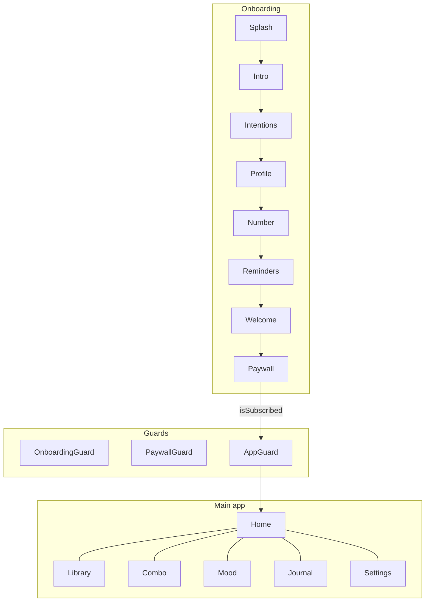
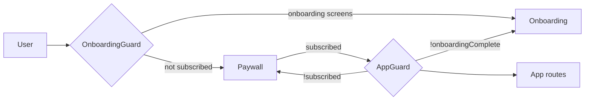

# Lumyn — Feature Map

Living index of product nodes (screens, systems, and infra). Update this when adding routes, Supabase tables, or guard flows.

## User journey (high level)

## Feature nodes

| Node | Route / entry | Status | Key files | Supabase |
|------|---------------|--------|-----------|----------|
| **onboarding-splash** | `/onboarding` | ✅ | `SplashScreen.tsx` | — |
| **onboarding-intro** | `/onboarding/intro` | ✅ | `IntroScreen.tsx` | — |
| **onboarding-intentions** | `/onboarding/intentions` | ✅ | `IntentionsScreen.tsx`, `IntentionsGrid.tsx` | `profiles.selected_intentions` |
| **onboarding-profile** | `/onboarding/profile` | ✅ | `ProfileScreen.tsx`, `ProfileForm.tsx` | `profiles` name/email/avatar |
| **onboarding-number** | `/onboarding/number` | ✅ | `PersonalNumberScreen.tsx` | `profiles` numerology fields |
| **onboarding-reminders** | `/onboarding/reminders` | ✅ | `RemindersScreen.tsx`, `RemindersSheet.tsx` | `reminder_frequency`, `reminder_time`, `reminder_weekday` |
| **onboarding-welcome** | `/onboarding/welcome` | ✅ | `WelcomeScreen.tsx` | — |
| **paywall** | `/onboarding/paywall` | ✅ | `PaywallScreen.tsx`, `purchases.ts`, `subscription-plans.ts` | `is_subscribed`, `trial_start_date`, `subscription_plan` |
| **home** | `/` | ✅ | `HomeScreen.tsx`, `daily-word.ts`, `moon.ts` | streak, moods (tiles) |
| **library** | `/library`, `/library/:id` | ✅ | `LibraryScreen.tsx`, `WordDetailScreen.tsx` | `saved_words` |
| **session** | `/session/:id` | ✅ | `SessionScreen.tsx` | journal on complete |
| **mantra** | `/mantra/:id` | ✅ | `MantraScreen.tsx` | settings mantra flags |
| **combo-builder** | `/combo` | ✅ | `ComboScreen.tsx` | `saved_combos` |
| **saved-combos** | `/combos` | ✅ | `SavedCombosScreen.tsx`, `PublishComboSheet.tsx` | `saved_combos`, publish → `community_combos` |
| **share-card** | `/share/:id` | ✅ | `ShareCardScreen.tsx` | — |
| **sigil** | `/sigil/:id`, `/sigil/community/:id` | ✅ | `SigilScreen.tsx`, `sigil.ts` | — |
| **mood-checkin** | `/mood`, `/mood/result` | ✅ | `MoodCheckinScreen.tsx`, `MoodResultScreen.tsx` | `mood_checkins` |
| **journal** | `/journal` | ✅ | `JournalScreen.tsx` | `journal_entries`, `synchronicity_entries` |
| **analytics** | `/analytics` | ✅ | `AnalyticsScreen.tsx` | — (local) |
| **discover** | `/discover` | ✅ | `DiscoverScreen.tsx` | `community_combos`, `community_upvotes` |
| **widget** | `/widget` | ✅ | `WidgetScreen.tsx`, PWA manifest | — |
| **settings** | `/settings` | ✅ | `SettingsScreen.tsx` | all profile/settings fields |
| **settings-intentions** | Settings sheet | ✅ | `IntentionsEditorSheet.tsx` | `selected_intentions` |
| **settings-reminders** | Settings sheet | ✅ | `RemindersSheet.tsx`, `reminder-scheduler.ts` | reminder columns |
| **settings-feedback** | Settings sheet | ✅ | `FeedbackSheet.tsx` | `feedback` |
| **edit-profile** | `/settings/profile` | ✅ | `EditProfileScreen.tsx`, `UserAvatar.tsx` | profile fields |
| **delete-account** | `/settings/delete-data` | ✅ | `DeleteDataScreen.tsx` | `delete_my_data()` RPC |
| **numerology** | `/profile/number` | ✅ | `PersonalNumberScreen.tsx` | numerology on `profiles` |
| **legal-privacy** | `/legal/privacy` | ✅ | `PrivacyScreen.tsx` | — |
| **legal-terms** | `/legal/terms` | ✅ | `TermsScreen.tsx` | — |

## System nodes

| Node | Purpose | Status | Key files |
|------|---------|--------|-----------|
| **state-local** | Offline-first persistence | ✅ | `storage.ts`, `AppContext.tsx` |
| **state-cloud** | Optional Supabase sync | ✅ | `supabase-sync.ts`, `supabase-session.ts`, `device-auth.ts` |
| **guards** | Onboarding + paywall + app access | ✅ | `Guards.tsx` |
| **notifications-web** | Daily/weekly reminders (PWA) | ✅ | `reminder-scheduler.ts`, `sw.js` |
| **notifications-native** | Capacitor local notifications | ✅ | `reminder-notifications-native.ts` |
| **iap-stub** | Paywall purchase/restore (web dev) | ✅ | `purchases.ts`, `ios/Products.storekit` |
| **switch-words-db** | 541 words + generator | ✅ | `switch-words-source.csv`, `generate-switch-words.py` |
| **keepalive** | Prevent Supabase free-tier pause | ✅ | `.github/workflows/supabase-keepalive.yml` |

## Supabase migrations (run in order)

1. `00001_lumyn_schema.sql` — core tables, RLS, community seeds
2. `00002_profile_moods.sql` — profile fields, `mood_checkins`
3. `00003_subscription.sql` — paywall / trial fields on `profiles`
4. `00004_community_publish.sql` — `submitted_by`, insert policy on `community_combos`
5. `00005_feedback_reminders.sql` — `feedback` table, reminder frequency columns

## Access gates

## v1.1 additions (since initial v1)

- Mandatory paywall (3-day trial, weekly/quarterly plans)
- Profile + avatar + edit profile
- Mood check-in sync to Supabase
- Device-auth fallback when anonymous auth is off
- Community combo **publishing** from saved combos
- Reminders: **Off / Daily / Weekly** + permission UX
- **Edit intentions** in Settings
- **In-app feedback** → `feedback` table
- GitHub **Supabase keepalive** workflow
- Switch word library expanded to **541** entries
